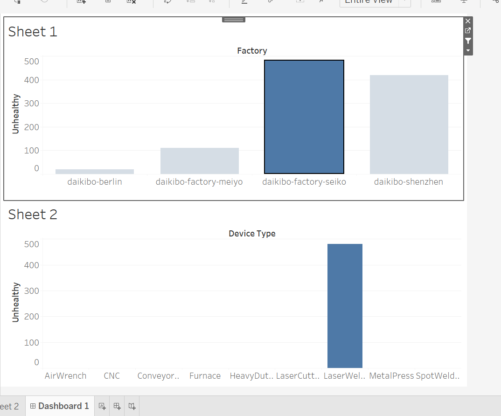

# 📊 Daikibo Telemetry Analysis

This project analyzes machine telemetry data from four Daikibo factories using Tableau. The goal is to uncover where the most significant assembly line disruptions occur and identify which machines are causing them.

## 🧠 Business Problem

Daikibo Industries collects telemetry data from 9 types of machines in 4 global factories (Tokyo, Osaka, Berlin, Shenzhen). The company wants to answer two key questions:

1. **Where did machines break the most?**
2. **Which machines were responsible for the most downtime in that location?**

## 🛠️ Tools Used

- **Tableau** – For visual analytics and dashboard building  
- **JSON** – Data format provided by the client  
- **GitHub** – For documentation and sharing results

---

## 📈 What Was Done

1. Loaded the telemetry data into Tableau  
2. Created a calculated field `Unhealthy = 10` (10 mins of downtime per unhealthy signal)  
3. Built two bar charts:  
   - “Down Time per Factory”  
   - “Down Time per Device Type”  
4. Combined both into an interactive dashboard

## 📊 Dashboard Output

The dashboard allows you to:
- View total downtime across all factories  
- Click on any factory bar to filter the machine types in that location

## 📷 Dashboard Screenshot

📎 A screenshot of the dashboard is available in the `screenshots/` folder.

## 📂 Dataset Preview

The telemetry data was collected over 1 month from all 4 factories. Each machine sent status messages every 10 minutes.
### 📁 You can find the full dataset in the 'data/ folder:
daikibo-telemetry-data.json

## 🔍 Key Insights

### ✅ Where are the disruptions happening?
- **Daikibo Factory Seiko (Osaka)** has the **highest machine downtime**.
- This is shown by the tallest bar in the **Down Time per Factory** chart.

### ✅ Why are the disruptions happening there?
- **LaserWelder machines** are the primary cause of downtime at Seiko.
- In the **Device Type** chart filtered for Seiko, LaserWelder clearly stands out.

### 🧠 Business Insight
- **Operational Issue:** Seiko is experiencing more disruptions than other sites, likely due to LaserWelder performance issues.  
- **Targeted Action:** Maintenance or replacement of LaserWelders at Seiko could significantly reduce downtime.  
- **Recommendation:** Investigate common failure causes for LaserWelders in Seiko (e.g., overuse, lack of maintenance, environmental factors).

## ✅ Conclusion
This analysis gives Daikibo a clearer understanding of operational bottlenecks and helps guide targeted maintenance strategies. The interactive dashboard allows ongoing monitoring of downtime trends by factory and machine type.
